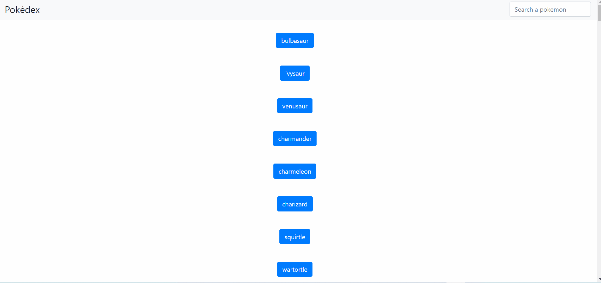

# Pokédex App

This simple App uses an external API to list a number of pokemon and show more details of them like pictures, names and heights. A search bar will help sort the pokemon by name. It is written in JavaScript, CSS and HTML.

# Link to live version on GitHub pages

https://alex-offner.github.io/pokedex-app/

# External resources used

API: https://pokeapi.co

Promise-polyfill: https://github.com/taylorhakes/promise-polyfill

Fetch-polyfill: https://github.com/github/fetch

Minifier: https://javascript-minifier.com/

jQuery Version 3.3.1 and bootstrap version 4.3.1 where used for styling and accessibility.

# Author

Alexander Offner
